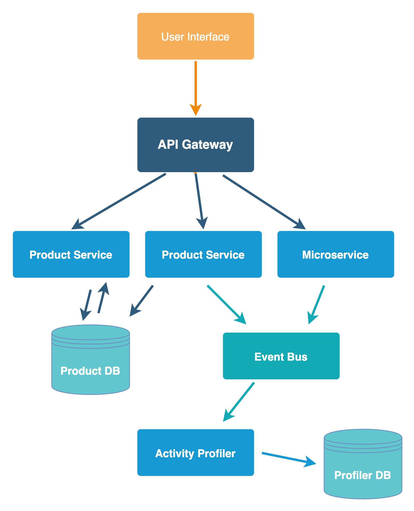

# About this Project
E-commerce is growing continuously and online shopping applications are becoming massive with a lot of functions. Microservice enables developers to develop software in small pieces. This approach is very useful for the larger teams as they can update, scale and test microservice separately.

<br />

## Microservices and Node.js. Express, Sequelize & MySQL.

This project provides a basic API that is responsive for all products where customers can filter, sort and search for products based on different criteria like name, price, branch, color, etc. It also connects to other systems to record all customers activities such as searching, filtering and viewing product details.

<br />

## Here is how it looks:
A high-level solution diagram for the components/infrastructure design. Microservices and Node.js are technology stacks that enable outstanding agility, security, scalability, and performance.

<p align="center">
    
</p>
<br />

### Microservice:
* **Product service**: This module has its own data table and independent access, providing APIs that returns product information.

* **Event bus**: Product service works independently, so it will not connect to other services to log activity. The Message Bus provides a method for the Product service to communicate messages to other services.

* **Activity Profiler**: logs access from the product service, which also has its own data table and can provide APIs for querying, aggregating, and statistical data. By default, this service is already registered in the message bus. In case you want to log the activity on other log storage services, you can register to listen to events from the message bus.

<br />

## Sequence diagram.

<p align="center">
    
</p>
<br />

## Entity relationship diagram for the database.

<p align="center">
    
</p>
<br />

### Tables
* **attributes**: contains all the attributes on the product should have, easy to expand in the future without having to change the table structure.

* **products**: Product list with basic information.

* **product_variants**: Variations of the product, with the same name and brand but different attributes.

* **product_attributes**: different products can have different variants, different variants have different attributes, this table makes it easy to assign attributes to variations, providing unlimited searchability.

* **activity_profilers**: this table belongs to the module `activity-profiler`. Storing user activity information into a specific data table makes it easier to query, categorize and organize common statistics.

<br />

## Software development principles, patterns & practices.
- Apply the principle of separation of concerns: Each component has been given a particular role. The role of the components is mutually exclusive. This makes the project easy to be unit tested.

- Sequelize ORM and mysql2 are used. Sequelize fits very well to the node.js application. Being NoSQL, fast, and scalable makes it ideal for modern web applications.

- Asynchronous execution is adopted. We have used async/await for the promises and made sure to use the non-blocking version of all the functions with few exceptions.

- Simple Message Bus implementation. Allows for send/receive and publish/subscribe pattern messaging between processes.

- Unit tests applied: The tests have been written to test the functions and routes. Integration tests has also been done.

<br />

## Code folder structure and the libraries / frameworks.
Project Directory Structure

```
├ src
├── product-service/
│   ├── .env
│   ├── app.js
│   ├── bin/
│   ├── configs/
│   │   ├── database.js
│   │   ├── services.js
│   ├── helpers/
│   │   ├── Response.js
│   │   ├── Pagination.js
│   │   ├── Translator.js
│   ├── languages/
│   │   ├── en.js
│   │   ├── vn.js
│   ├── middlewares/
│   │   ├── ActivityProfiler.js
│   ├── routes/
│   │   ├── index.js
│   │   ├── ProductRouter.js
│   ├── controllers/
│   │   ├── ProductController.js
│   ├── services/
│   │   ├── ProductService.js
│   ├── repositories/
│   │   ├── ProductRepository.js
│   │   ├── ProductVariantRepository.js
│   │   ├── ProductAttributeRepository.js
│   ├── models/
│   │   ├── index.js
│   │   ├── ProductsModel.js
│   │   ├── AttributesModel.js
│   │   ├── ProductVariantModel.js
│   │   ├── ProductAttributeModel.js
```
The role of each component is clearly defined.

This project uses Express.js, and Router `/routes/*` has been optimized. The router takes the request and decides which `controller/*action` methods will handle the request.

Service objects `/services/*` are responsible for performing the user's interaction with the application. It contains business logic coordinates other parties, that perform the actual functions of the application, collect data and response to `controllers`.

The models `/models/*` are the database model, that are the essence of Sequelize, defines the schema document and represents a table in database.

Similarly, we have the Repositories `/repositories/*`, which has the role of providing all the queries to the other application components related to models. Repositories class's methods return the plain object as the query result. This layer is designed to only be concerned with the data storage, and the consumer of the data does not have to be aware about this.

<br />

## Build and run this project
This project primary focus is to create a maintainable and highly testable architecture, enhances the ability to share code across projects. It does not reuire any special installation, easy to deploy without any setup and configurations.

If having any issue then make sure 3000, 3001, 3009 port is not occupied else provide a different port in .env file.

### Database servers
Assume that MySQL is installed and running on the local computer, or you can use docker to get them run on the local machine.

Change the DB_HOST, DB_NAME, and other information to localhost in .env and tests/.env.test files.

### Clone this repo

```
$ git clone https://github.com/tientamle/nab
```

<br />

## Build & start the services
Install node.js and npm on your local machine. From the root of the project executes in terminal as below:

```
$ cd src/product-service/
$ npm install
$ npm start
```

We are starting a project from scratch, and our database is empty, after starting Sequelize automatically creates every table in the database.

Repeat the above command for `src/activity-eventbus/` and `src/activity-profiler/`. After execute `npm start` and we will be able to access the API from `http://localhost:3000`.

To run the tests execute `npm test`.

```
$ cd src/product-service/
$ npm test
```

<br />

## API Examples
CURL commands to verify the APIs.

* Initial dummy data: after starting, the database is empty, execute this API to insert dummy data.

```
curl --location --request GET 'http://localhost:3000/products/dump'
```

* Search products with paging, filters and sort. Any parameter can be removed or adding more another attribute code to search.

```
curl --location --request GET 'http://localhost:3000/products/?page=1&limit=10&sort=ASC&order=price&color=Y&size=U'
```

* Get product details and variants by product id:
```
curl --location --request GET 'http://localhost:3000/products/7'
```

* Message Bus has been set up to send data to `Activity Profiler Service`.
    * Listening at `http://localhost:3001/listener`.
    * You can add more service listeners at any time by calling this API.

```
curl --location --request POST 'http://localhost:3009/events/registry' \
--header 'Content-Type: application/json' \
--data-raw '{
    "register": "https://enwgsaoavkrns1i.m.pipedream.net/events"
}'
```

<br />

### I hope you found this project useful! :heart:
